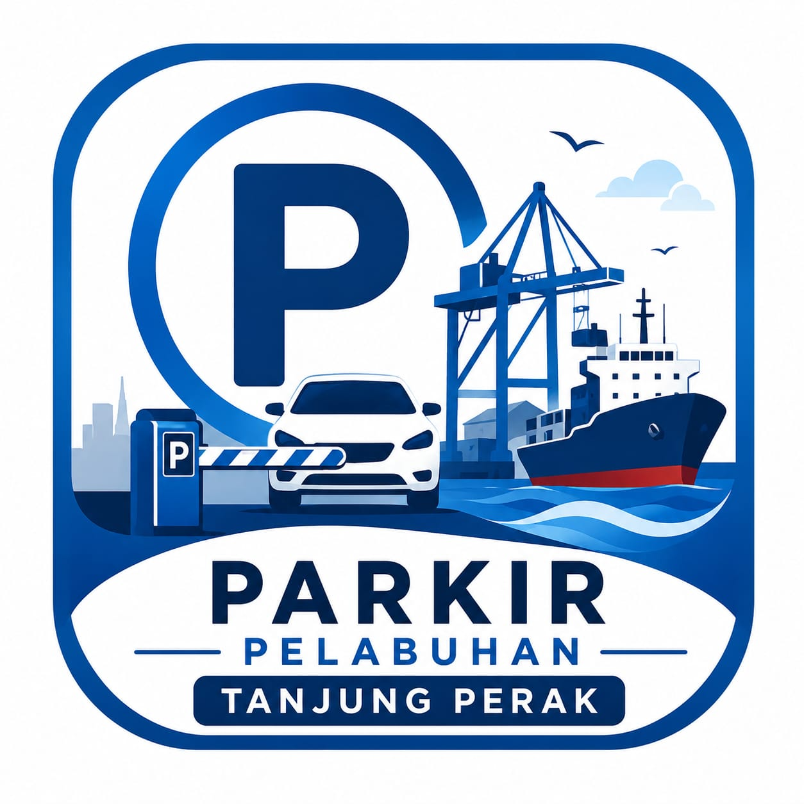

<div align="center">



# Aplikasi Parkir — Frontend

### Single Page Application (React + Vite) untuk Sistem Manajemen Parkir Digital

Portal booking, transaksi, pembayaran QRIS, dan rekap laporan parkir — mengonsumsi [REST API Laravel](https://github.com/Bobyrpl/backend-apk-parkir) lewat Axios, di-deploy sebagai SPA statis di Vercel.

[](https://react.dev)
[](https://vitejs.dev)
[](https://tailwindcss.com)
[](https://reactrouter.com)
[](https://vercel.com)
[](https://opensource.org/licenses/MIT)

[](https://github.com/Bobyrpl/Frontend-apk-parkir)
[](https://github.com/Bobyrpl/Frontend-apk-parkir/stargazers)
[](https://github.com/Bobyrpl/Frontend-apk-parkir/issues)
[](https://github.com/Bobyrpl/Frontend-apk-parkir/commits/main)

[Demo ↗](https://frontend-apk-parkir.vercel.app) • [Fitur](#-fitur) • [Teknologi](#️-teknologi-yang-digunakan) • [Instalasi](#-instalasi) • [Struktur](#-struktur-proyek)

</div>

---

## 📋 Tentang Proyek

Repo ini adalah **frontend** Aplikasi Parkir, dipisah dari backend sejak proyek ini di-split menjadi dua repository:

- 🎨 **Frontend (repo ini):** [Bobyrpl/Frontend-apk-parkir](https://github.com/Bobyrpl/Frontend-apk-parkir) — React SPA murni (Vite), di-deploy ke **Vercel**.
- 🔧 **Backend:** [Bobyrpl/backend-apk-parkir](https://github.com/Bobyrpl/backend-apk-parkir) — Laravel 12 REST API, di-deploy ke **Railway**.

Berbeda dari pola Laravel + Inertia, di sini React **tidak disajikan oleh Laravel sama sekali** — aplikasi ini adalah SPA statis independen yang seluruh komunikasi datanya lewat HTTP ke REST API backend (lihat `src/api/axios.js`), diautentikasi dengan token **Laravel Sanctum** yang disimpan di `sessionStorage`.

> 🌐 **Live demo:** [frontend-apk-parkir.vercel.app](https://frontend-apk-parkir.vercel.app)
> 🔌 **API yang dikonsumsi:** `https://backend-apk-parkir-production-ec0c.up.railway.app/api`

### 👥 Role Pengguna

<table>
<tr>
<td align="center" width="25%">

**👑 Admin**

Kelola user, tarif, area parkir, kendaraan, pengaturan denda, permintaan aktivasi, dan log aktivitas

</td>
<td align="center" width="25%">

**🧑‍💼 Owner**

Memantau dashboard & rekap laporan

</td>
<td align="center" width="25%">

**🧍 Petugas**

Mencatat kendaraan masuk/keluar, kelola booking, dan transaksi di lapangan

</td>
<td align="center" width="25%">

**🙋 Pelanggan**

Booking slot parkir, kelola kendaraan sendiri, dan lihat riwayat booking

</td>
</tr>
</table>

## ✨ Fitur

|     | Fitur                    | Deskripsi                                                                                     |
| --- | ------------------------- | ------------------------------------------------------------------------------------------------ |
| 🔐  | **Autentikasi**           | Login, Register, dan login lewat Passkey — token Sanctum tersimpan di `sessionStorage`           |
| 🅿️  | **Area Parkir & Tarif**   | Manajemen area/slot parkir dan tarif (khusus Admin)                                              |
| 🚗  | **Kendaraan**             | Pencatatan data kendaraan, pencarian cepat by plat nomor, scan QR (`html5-qrcode`)                |
| 📅  | **Booking Online**        | Pelanggan booking slot parkir, Admin/Petugas konfirmasi/tolak, modal QR booking                   |
| 💳  | **Transaksi & Struk**     | Kendaraan masuk/keluar, cetak struk digital, ekspor struk ke `.docx`                              |
| 💰  | **Pembayaran QRIS**       | Modal QRIS untuk pembayaran (integrasi DANA di backend), cek status bayar real-time               |
| ⚖️  | **Pengaturan Denda**      | Admin atur aturan denda keterlambatan                                                             |
| 👥  | **User Management**       | Manajemen user, hak akses, dan proses permintaan aktivasi ulang akun                              |
| 📝  | **Log Aktivitas**         | Rekam jejak aktivitas pengguna                                                                   |
| 💬  | **Komentar**              | Pengunjung landing page bisa mengirim & melihat komentar, Admin bisa membalas                     |
| 📊  | **Dashboard & Rekap**     | Dashboard per role (Admin/Owner/Petugas) + rekap transaksi grafik (`recharts`) untuk Owner        |
| 🔔  | **Notifikasi & Toast**    | Konteks toast global untuk feedback aksi (`ToastContext`)                                        |

## 🛠️ Teknologi yang Digunakan

<div align="center">

|     Kategori     | Teknologi                                          |
| :---------------: | :--------------------------------------------------- |
|   **Framework**   | React 19 (Single Page Application)                   |
|   **Build Tool**  | Vite 7                                                |
|    **Routing**    | React Router 7                                        |
|    **Styling**    | Tailwind CSS 4, Bootstrap 5 (komponen tertentu)        |
|  **HTTP Client**  | Axios (interceptor Bearer token + auto-redirect 401)   |
|      **Chart**    | Recharts                                              |
|    **Ikon**       | lucide-react                                          |
| **QR / Scan**     | `qrcode` (generate), `html5-qrcode` (scan kamera)      |
| **Ekspor Dokumen**| `docx` (struk ke Word)                                 |
|  **Deployment**   | Vercel                                                |

</div>

## 📦 Instalasi

> **Prasyarat:** Node.js & NPM. Backend API ([backend-apk-parkir](https://github.com/Bobyrpl/backend-apk-parkir)) sudah berjalan (lokal atau pakai API production).

**1. Clone repository**

```bash
git clone https://github.com/Bobyrpl/Frontend-apk-parkir.git
cd Frontend-apk-parkir
```

**2. Install dependency**

```bash
npm install
```

**3. Konfigurasi URL API**

Buat file `.env` di root project untuk mengarahkan ke backend:

```env
VITE_API_URL=http://localhost:8000/api
```

Jika `VITE_API_URL` tidak di-set, aplikasi otomatis fallback ke API production di Railway (lihat `src/api/axios.js`).

## 🚀 Menjalankan Aplikasi

```bash
npm run dev
```

Aplikasi dapat diakses melalui:

```
http://localhost:5173
```

**Build untuk production:**

```bash
npm run build
npm run preview   # opsional, preview hasil build
```

> Deployment ke Vercel memakai `vercel.json` (SPA rewrite semua route ke `index.html`) — cukup hubungkan repo ini ke Vercel dan set environment variable `VITE_API_URL` mengarah ke backend Railway.

## 📁 Struktur Proyek

```
Frontend-apk-parkir/
├── public/
│   ├── images/                # Aset gambar (hero, logo sekolah, dll)
│   ├── parkir_pelabuhan_tanjung_perak.png
│   └── video.mp4
├── src/
│   ├── api/axios.js            # Konfigurasi HTTP client ke Laravel API + interceptor token
│   ├── components/
│   │   ├── Layout.jsx
│   │   ├── ModalQrBooking.jsx
│   │   ├── ModalQris.jsx       # Modal pembayaran QRIS
│   │   ├── ModalScanQr.jsx     # Scan QR via kamera
│   │   ├── ProtectedRoute.jsx  # Guard route berbasis role
│   │   ├── StrukCard.jsx
│   │   └── ui.jsx
│   ├── context/
│   │   ├── AuthContext.jsx     # State login & role user
│   │   └── ToastContext.jsx    # Notifikasi toast global
│   ├── pages/
│   │   ├── admin/               # AreaParkir, Dashboard, Kendaraan, Komentar,
│   │   │                        # LogAktivitas, PengaturanDenda, PermintaanAktivasi,
│   │   │                        # Tarif, Users
│   │   ├── owner/                # DashboardOwner, Rekap
│   │   ├── pelanggan/            # Booking, RiwayatBooking
│   │   ├── petugas/              # Booking, DashboardPetugas, KendaraanKeluar/Masuk,
│   │   │                         # TambahKendaraan, Transaksi
│   │   └── Landing.jsx, Login.jsx, Register.jsx, Bantuan.jsx
│   ├── utils/sound.js           # Notifikasi suara (Web Audio API)
│   ├── app.jsx / main.jsx       # Entry point React
│   └── app.css / index.css
├── index.html
├── vite.config.js
├── vercel.json                  # Konfigurasi rewrite untuk SPA di Vercel
└── package.json
```

## 🔗 Repo Terkait

- 🔧 Backend (Laravel REST API): [github.com/Bobyrpl/backend-apk-parkir](https://github.com/Bobyrpl/backend-apk-parkir)

## 🤝 Kontribusi

Proyek ini dibuat untuk keperluan Uji Kompetensi Keahlian (UKK). Saran dan masukan tetap terbuka melalui [issue](https://github.com/Bobyrpl/Frontend-apk-parkir/issues) atau [pull request](https://github.com/Bobyrpl/Frontend-apk-parkir/pulls).

## 📄 Lisensi

Proyek ini dibuat untuk tujuan pembelajaran/tugas sekolah — silakan sesuaikan lisensi (mis. [MIT](https://opensource.org/licenses/MIT)) sesuai kebutuhan.

---

<div align="center">

## 👤 Penulis

**Bobyrpl**

[](https://github.com/Bobyrpl)
[](https://github.com/Bobyrpl/Frontend-apk-parkir)

<a href="https://canva.link/7riihmdsitd9uju">link Struk</a>

<sub>Dibuat dengan ❤️ untuk Uji Kompetensi Keahlian (UKK)</sub>

</div>